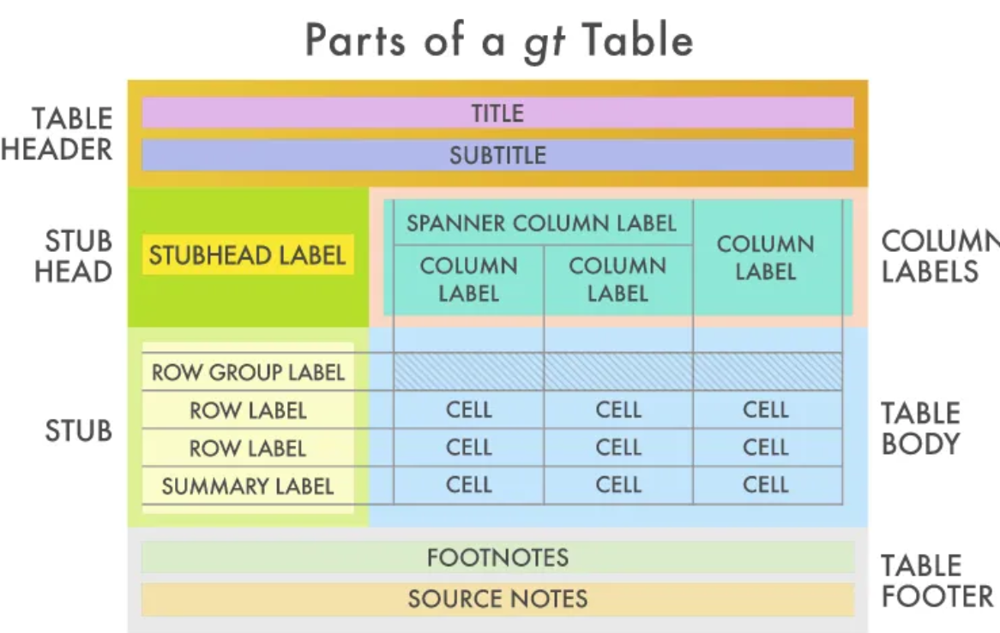

## Packages

```{r}
library(gt)
library(gtExtras)
library(dplyr) # for pipeline stuff
library(htmltools) # for tagList
library(svglite) # for sparkline plots
library(webshot2) # for saving a gt object as a png
```

## What is GT (grammar of tables)

Visualization isn't just graphs, it also includes tables. Today we're going to look at a package that uses the grammar of graphics principles of working in layers and treating graphs as objects that can be added onto, and applying them to tables.

(Diagram from: https://towardsdatascience.com/exploring-the-gt-grammar-of-tables-package-in-r-7fff9d0b40cd  and https://gt.rstudio.com/ )

{width=70%}

{width=70%}


## Basic GT tables

(Copied from https://r-graph-gallery.com/package/gt.html with some added commentary)

First, we'll set up some data.  TO DO: Replace with sports data.

```{r}
# Create a simple data frame
data = data.frame(
  Country = c("USA", "China", "India", "Brazil"),
  Capitals = c("Washington D.C.", "Beijing", "New Delhi", "Brasília"),
  Population = c(331, 1441, 1393, 212),
  GDP = c(21.43, 14.34, 2.87, 1.49)
)
```

Then we'll put that `data.frame` into a `gt()` table just as we would do a with a `ggplot()`. The pipeline operator `%>%` means "take what's on the left, and place it into the first argument in the function on the right. With tidyverse functions like `ggplot` and `gt`, the first argument is always the dataset.

```{r}
# Alternatively you can do (same output):
#gt(data)

# Use the gt function
data %>%
  gt()

```


## Basic GT tables - Titles

Titles can be added, and markdown text editing can be applied to the title and subtitle as long as you have the `md()` function wrapping around the text. 


Notice the markdown, that the double stars `**` indicate bold, the single stars `*` indicate italics, and the the single slanted quotations `\`\`` indicate a code block.

```{r}
data %>%
  gt() %>%
    tab_header(title = md("What a **nice title**"),
               subtitle = md("Pretty *cool subtitle* too, `isn't it?`"))
```

## Basic GT tables - Titles


Notice that we don't need to specify the data again, we technically don't even need to specify the table again if we save the table as an object like we would with a graph.


```{r}
basic_gt <- data %>% gt()

basic_gt %>%
    tab_header(title = "Basic text can go here too",
               subtitle = md("You *need* to have the `md()` wrapper to do more"))
```

## Basic GT tables - Titles

We can also use HTML instead of markdown. There isn't a way to change the colour of text like this with markdown, unfortunately.


```{r}
# create and display the gt table 
data %>%
  gt() %>%
    tab_header(title = html("<span style='color:red;'>A red title</span>"))
```


## Basic GT tables - Titles

We can add images too, using HTML. (It doesn't matter if you use `html()` or `HTML()`)

```{r}
data %>%
  gt() %>%
    tab_header(title = html("<span style='color:red;'>A <strong>red</strong> title</span>"),
               subtitle = tagList(
                 tags$div(style = css(`text-align` = "center"),
                          HTML(web_image("https://www.r-project.org/logo/Rlogo.png")
                     )
                   )
                 )
               )
```


## Basic GT tables - Titles

You can include an image using markdown as well.

```{r}
data %>%
  gt() %>%
    tab_header(title = md("{width=30%}"))
```


## Basic GT tables - Footers

We can also use HTML instead of markdown. There isn't a way to change the colour of text like this with markdown, unfortunately.

`tab_footer()` behaves a lot like `tab_header()`, but for the bottom of the table.

```{r}
data %>%
  gt() %>%
    tab_footnote(footnote = md("This text is the footer of this **table**"))
```

## Basic GT tables - Footers


```{r}
data2 = data.frame(
  Planet = c("Earth", "Mars", "Jupiter", "Venus"),
  Moons = c(1, 2, 79, 0),
  Distance_from_Sun = c(149.6, 227.9, 778.3, 108.2),
  Diameter = c(12742, 6779, 139822, 12104)
)
```


We can do multiple footnotes, and we can specify for all footnotes whether the superscripts should be `numbers`, `letters`, `LETTERS`, `standard` symbolic marks, or `extended` symbolic marks.

```{r}
data2 %>%
  gt() %>%
    tab_footnote(footnote = md("Measured in **millions** of Km"),
                 locations = cells_column_labels(columns = Distance_from_Sun)) %>%
    tab_footnote(footnote = md("Measured in **Km**"),
                 locations = cells_column_labels(columns = Diameter)) %>%
    tab_footnote(footnote = md("The original data are from *Some Organization*")) %>%
    opt_footnote_marks(marks = "LETTERS")
```


```{r}
data2 %>%
  gt() %>%
    tab_footnote(footnote = md("Measured in **millions** of Km"),
                 locations = cells_column_labels(columns = Distance_from_Sun)) %>%
    tab_footnote(footnote = md("Measured in **Km**"),
                 locations = cells_column_labels(columns = Diameter)) %>%
    tab_footnote(footnote = md("The original data are from *Some Organization*")) %>%
    opt_footnote_marks(marks = "extended")
```


## Basic GT tables - Footers

We can also refer to certain elements with headers and footers.

```{r}
data %>%
  gt() %>%
    tab_footnote(footnote = md("English name"),
                 locations = cells_column_labels(columns = Country))
```


## Basic GT tables - Spanners

We can also add things like superheaders for titles when we want to group certain columns together. Notice here that the order in which we add the `tab_spanner()` elements doesn't matter; we can add the two on the right before we add the two on the left.

```{r}
basic_gt %>%
   tab_spanner(
    label = "Number",
    columns = c(GDP, Population)) %>%
  tab_spanner(
    label = "Label",
    columns = c(Country, Capitals)
  )
```


## Basic GT tables - Spanners


Notice here that the `Capitals` column has two labels. The most recently added `tab_spanner` goes on the top in that case. Also notice that the columns selected do not need to be contiguous. If you need to rearrange the variables themselves, that can be done to the original `data.frame`.

```{r}
basic_gt %>%
   tab_spanner(
    label = "Label One",
    columns = c(GDP, Capitals)) %>%
  tab_spanner(
    label = "Label Two",
    columns = c(Country, Capitals)
  )
```


## GT Extras

Taken from https://r-graph-gallery.com/368-plotting-in-cells-with-gtextras.html

If you want to put charts in the cells of a table, you necessarily need to aggregate your data at some point. This is because you can’t really create any chart with a single value.

In this post, we’ll work with the iris dataset. This dataset has 5 columns: 4 quantitative and 1 qualitative (Species, with 3 distinct labels). A simple way to aggregate these data is to group by the Species column.

It implies that we will have a new dataset with 3 rows and as much column. Now that we have grouped by the dataset, we need to use an aggregation measure for the quantitative columns. And because we want to create chart for those cols, the aggregation will be the list of all values for the given species.

Here’s how to do it:

```{r}
# load the dataset
data(iris)
head(iris)
tail(iris)
```


This will create a list of 50 elements in each cell of the data.frame including the 50 values for that variable for that species.

```{r}
# create aggregated dataset
agg_iris = iris %>%
  group_by(Species) %>%
  summarize(
    Sepal.L = list(Sepal.Length),
    Sepal.W = list(Sepal.Width),
    Petal.L = list(Petal.Length),
    Petal.W = list(Petal.Width)
    )
```


## GT Extras

This will take that data frame of lists and make it a `gt` table.

```{r}
# display the table with default output with gt package
agg_iris %>%
  gt()

```


## GT Extras - Plots


The `gt_plt_sparkline()` function creates a line chart in table cells. It requires to add a line of code for each column you want to display. In our case, it means one line of code for each column.

In a sparkline, the highest value and the lowest value are marked, and the rest is just a line plot of the values.


```{r}
# Needs svglite package
agg_iris %>%
  gt() %>%
  gt_plt_sparkline(Sepal.L) %>%
  gt_plt_sparkline(Sepal.W) %>%
  gt_plt_sparkline(Petal.L) %>%
  gt_plt_sparkline(Petal.W)
```


## GT Extras - Plots

We can also look at distribution plots of these lists with the `gt_plt_dist` function, in which we specify the variable name, and the type of plot. All four options for density plots are shown here: `density` (KDE), `boxplot`, `histogram`, and `rug_strip`.

Other plotting functions include:

- `gt_plt_bar_pct()`, 
- `gt_plt_bar_stack()`, 
- `gt_plt_bar()`, 
- `gt_plt_percentile()`, 
- `gt_plt_point()`, 
- `gt_plt_sparkline()`, and 
- `gt_plt_winloss()`

```{r}
agg_iris %>%
  gt() %>% 
  gt_plt_dist(Sepal.L, type = "density") %>%
  gt_plt_dist(Sepal.W, type = "boxplot") %>%
  gt_plt_dist(Petal.L, type = "histogram") %>%
  gt_plt_dist(Petal.W, type = "rug_strip")
```


## GT Extras - Plots


The `gt_plt_bar_pct()` does not require aggregate data. The chart is actually a score bar that measures how close the value in the cell is to the maximum value in that column OF THE VALUES THAT ARE INCLUDED IN THE TABLE.

This means that the highest value in the table has its bar full.

Notice here that we're only using the first six rows of data, so the percentages are of the maximum of the first six rows, not the whole thing.


```{r}
head(iris) %>%
  gt() %>%
  gt_plt_bar_pct(Sepal.Length, labels = TRUE) %>%
  gt_plt_bar_pct(Sepal.Width, labels=FALSE, fill = "forestgreen")
```


## GT Extras - Plots


The `gt_plt_summary()` can, in just one single line of code, summarizes your entire dataset.

If you have correctly specified the data type in your dataframe, it will automatically aggregate columns and display the right chart for them!

Notice that all 150 rows of `iris` are going into this, and that we're not doing anything to aggregate them beforehand.

```{r}
iris %>%
  gt_plt_summary()
```


## GT Extras - Themes

(Code taken from the help files of `gtExtras`)

We can apply several premade themes using `gt_theme_???` where `???` is any of several options.

This includes the ESPN website style:

```{r}
themed_tab <- head(mtcars) %>%
  gt() %>%
  gt_theme_espn()

themed_tab
```


## GT Extras - Themes

A dot-matrix printer style with fixed width text.


```{r}
themed_tab2 <- head(mtcars) %>%
  gt() %>%
  gt_theme_dot_matrix()

themed_tab2
```


## GT Extra - Themes

Or the New York Times style of publishing tables


```{r}
themed_tab3 <- head(mtcars) %>%
  gt() %>%
  gt_theme_nytimes()

themed_tab3
```


Other Themes include: 

- `gt_plt_bullet()`, 
- `gt_plt_conf_int()`, 
- `gt_plt_dot()`, 
- `gt_theme_538()`, 
- `gt_theme_dark()`,
- `gt_theme_excel()`, 
- `gt_theme_guardian()`, 
- `gt_theme_pff()`


## GT Case Study - Palmer Penguins

Taken from: https://towardsdatascience.com/exploring-the-gt-grammar-of-tables-package-in-r-7fff9d0b40cd

Notice how `gt()` respects the `group_by` function by adding spacer rows in between islands.


```{r}
penguins = read.csv("Penguins_clean.csv")
```

```{r}
pendata <- penguins %>%
          tibble() %>% # convert from data.frame to tidyverse tibble
          filter(species == "Adelie") %>%
          group_by(island, year) %>%
          summarise_if(is.numeric, sum)

pendata

pentab = pendata %>% gt()

pentab
```


## GT Case Study - Palmer Penguins

In `library(gt)`, the `data_color` function adds colours to data cells.


```{r}
pentab2 <- pentab %>% data_color(palette = "PuOr")
pentab2
```


## GT Case Study - Palmer Penguins

We can specify columns (and rows), and use any one of 25 palettes available from RColorBrewer or viridis. (Or make our own if we have a team theme to go for)

See `?data_color` for the rest of the available palettes.


```{r}

pentab3 <- pentab %>% data_color(palette = "Spectral",
                              columns = c(bill_length_mm_male, bill_depth_mm_male, 
                            flipper_length_mm_male, body_mass_g_male,
                            bill_length_mm_female, bill_depth_mm_female,
                            flipper_length_mm_female, body_mass_g_female))

pentab3
```


## Grouping variables

(Heavily modified from https://themockup.blog/static/resources/gt-cookbook.html )

We can use a variable in the dataset as a grouping variable to put break lines into the output table when outputting a dataset as a table.

To demonstrate this, first, let's take a few rows and columns from `mtcars`.

```{r}
mtcars_mini = mtcars[1:10, c("cyl","gear","hp","wt","mpg")]
mtcars_mini %>% gt() 
```

Now let's use the `groupname_col` option in `gt` to establish a column as the group name. Notice that `cyl` disappears from the column and appears as breaker. (adding a `group_by()` line before `gt()` does the same thing)


```{r}
mtcars_mini %>% 
  gt(groupname_col = "cyl")
```


## Grouping variables

We can also make the grouping variable a character variable and it works the same way. Notice that the `dplyr` function `mutute` changes the values of the variable, not the name of the variable, so we can see refer to `cyl` in the `gt()` line.


```{r}
mtcars_mini %>% 
   mutate(cyl = paste(cyl, "Cylinders"))
```


```{r}
mtcars_mini %>% 
  mutate(cyl = paste(cyl, "Cylinders")) %>% 
  gt(groupname_col = "cyl")
```


## Grouping variables

We can use multiple grouping variables too, where later-listed variables are treated as subgroups.

(See https://themockup.blog/static/resources/gt-cookbook.html#custom-groups for information on custom groups like splitting a continuous variable, or by the first letter of a name.)

```{r}
mtcars_mini %>% 
  mutate(cyl = paste(cyl, "Cylinders"), gear = paste(gear, "Gears")) %>% 
  gt(groupname_col = c("cyl","gear"))
```

## Group variables

We can arrange to put the groups on the side instead of as inserts by using `rowname_col` instead of `groupname_col`. This only seems to work with a single variable (but I may be wrong)


```{r}
mtcars_mini %>% 
  mutate(cyl = paste(cyl, "Cylinders")) %>% 
  gt(rowname_col = "cyl")
```

## Saving gt objects

You can save the output of a gt object as HTML or LaTeX code, or as a PNG or PDF image, or at RTF (Rich text format) output. `gtsave()` will guess what format you want from the file name.


```{r}
mtcars_famcy <- mtcars %>% 
  mutate(cyl = paste(cyl, "Cylinders")) %>% 
  gt(rowname_col = "cyl")

gtsave(mtcars_famcy, "mtcars.pdf")
gtsave(mtcars_famcy, "mtcars.html")
gtsave(mtcars_famcy, "mtcars.png") # requires webshot2 package
```

## Conditional formatting

`gt()` can do conditional formatting too.

```{r}
stocks <- data.frame(
  Symbol = c("GOOG", "FB", "AMZN", "NFLX", "TSLA"),
  Price = c(1265.13, 187.89, 1761.33, 276.82, 328.13),
  Change = c(4.14, 1.51, -19.45, 5.32, -12.45)
)
```

```{r}
stocks %>% gt()
```

## Conditional formatting

This is done with `tab_style`, which has a few settings you need.

- `style = <thing to set>`, in this case, we're changing the `cell_text`.
- `locations = <where to set it>`, in this case, we're choosing the variable `Change` only for certain rows.

```{r}
stocks %>% 
  gt() %>% 
  tab_style(
    style = cell_text(color = "red", weight = "bold"),
    locations = cells_body(
      columns = c(Change, Price),
      rows = Change < 0)) %>% 
  tab_style(
    style = cell_text(color = "blue", style = "italic"),
    locations = cells_body(
      columns = c(Change, Price),
      rows = Change >= 0))
```

## Table customization

With `opt_...` we can apply table customization options.

```{r}
mtcars_mini %>% 
  gt() %>% 
  opt_table_lines("all")
```


## Table customization

With `opt_...` we can apply table customization options.

```{r}
mtcars_mini %>% 
  gt() %>% 
   opt_table_outline()
```


## Table customization

We can even use `google_font` to pull down fonts from Google and use those. See https://fonts.google.com/ for demos.

```{r}
mtcars_mini %>% 
  gt() %>% 
opt_table_font(font = list(google_font(name = "Merriweather"), "Cochin", "Serif"))

```

## Table customization


Other table option functions include: 

- `opt_align_table_header()`, 
- `opt_all_caps()`, 
- `opt_css()`, 
- `opt_footnote_marks()`, 
- `opt_footnote_spec()`, 
- `opt_horizontal_padding()`, 
- `opt_interactive()`, 
- `opt_row_striping()`, 
- `opt_stylize()`, 
- `opt_table_font()`, and 
- `opt_vertical_padding()`


## Extenal images

We can bring in external images like team logos with with `gt_img_rows`. First we need the URLs of the images.

```{r}
teams <- "https://github.com/nflverse/nflfastR-data/raw/master/teams_colors_logos.rds"
team_df <- readRDS(url(teams)) 

team_df <- tail(team_df) %>% 
  dplyr::select(team_wordmark, team_abbr, logo = team_logo_espn, team_name:team_conf)
team_df
```

## Extenal images

We can bring in external images like team logos with with `gt_img_rows`. 

We do this by specifying the `columns` to place the image, `height` (or `width`) to make sure it fits nicely in the table, and possibly `img_source` for technical purposes.


```{r}
 logo_table <- team_df %>%
   gt() %>%
   gt_img_rows(columns = team_wordmark, height = 25) %>%
   gt_img_rows(columns = logo, img_source = "web", height = 30)

logo_table
```

## See also:

See also: 

- the great_tables Python library - https://posit-dev.github.io/great-tables/get-started/
- formatting cells into things with money signs and commas with `fmt_currency`

