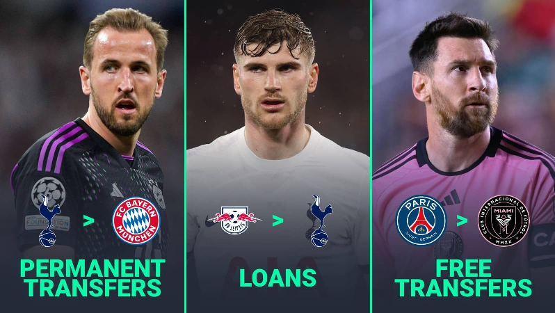
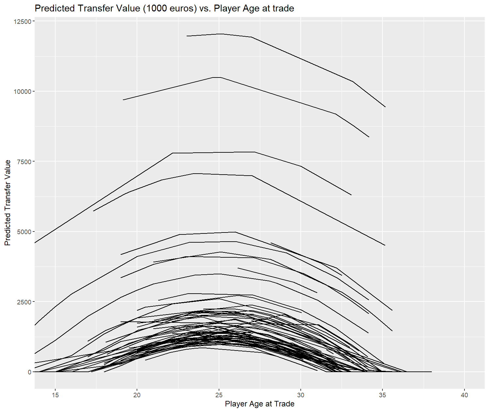
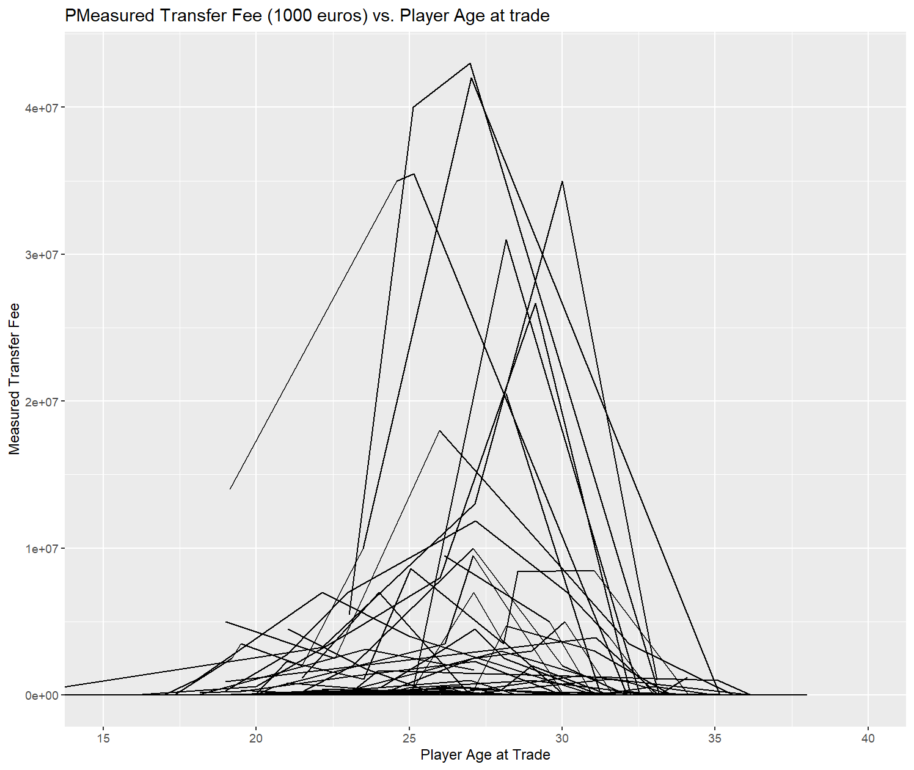
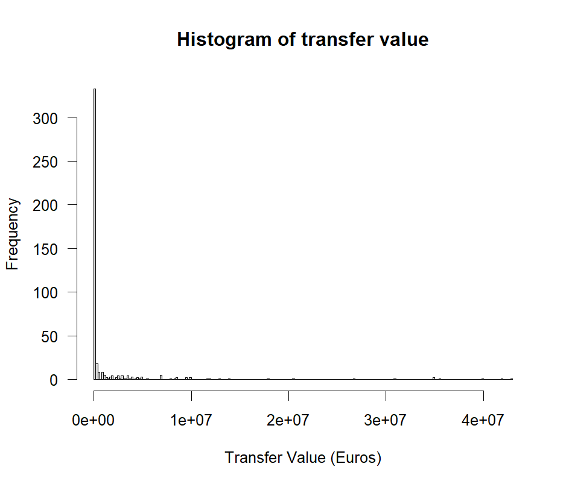
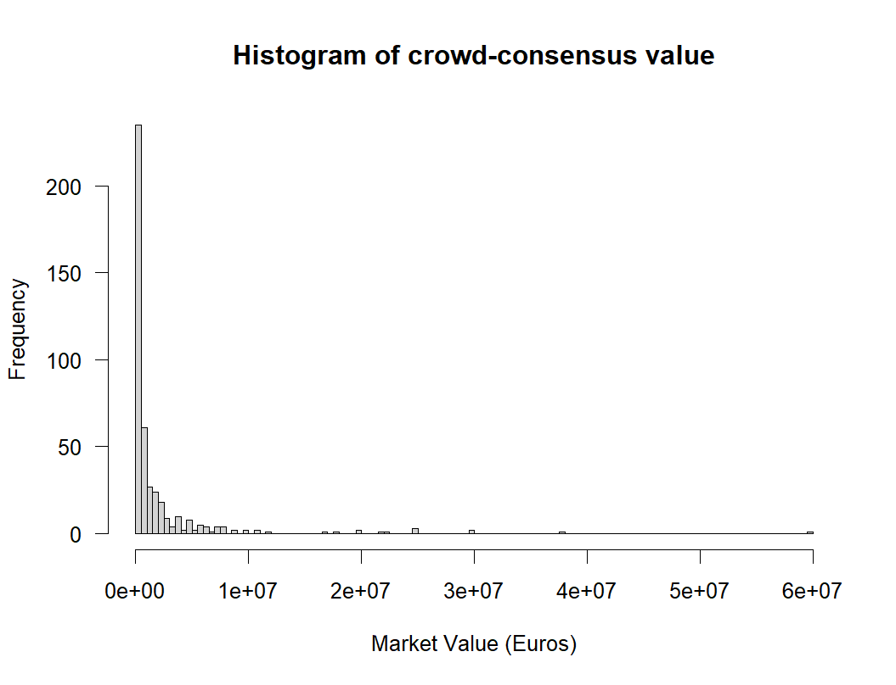

# What is the Transfer Market

In North American sports, there is typically one apex league and a bunch of feeder leagues. However, soccer is played in national leagues in many countries, so there are many apex leagues.


Because of North American sports' single apex model, things like drafts can happen where a player must either play for one apex league organization, or not at all. However, with multiple comparable leagues, transfers get a lot more complicated. Usually there is a transfer fee paid from the recieving team to the sending team.


# What is the Transfer Market

Images and quotes from "How soccer transfers work in Europe: Everything you need to know" by Samuel Bannister on 20 May 2024 at https://www.teamtalk.com/news/how-soccer-transfers-work 



*"In either of [the winter and summer] transfer windows, clubs can sign players from other teams."*

*The only players that teams can sign outside of the transfer windows are free agents, who are players who don’t have a club at that time.*


# What is the Transfer Market

*"The most common way for clubs to sign players is by paying a transfer fee to the club they are buying them from. This type of transfer is called a permanent transfer."*

*"The club wanting to buy the player has to make a bid to their current club, who can then accept or reject it. If the bid is accepted, the buying club then get to negotiate a contract with the player. If the player accepts the wages on offer and passes a medical examination, he then signs his contract with his new club."*


# What is the Transfer Market

*"How do free transfers work?"*

*"As mentioned, some players don’t cost any transfer fee at all because they don’t currently have a club. These free agents are players whose contracts with their last clubs have expired (in other words, they have been released)."*


# What is the Transfer Market

*"Another type of transfer is a loan. Usually (but not always) designed for younger players, this is where a club sends a player to another team for a period of time (often a whole season or half a season) and then takes them back after."*

*"Loan transfers mainly give players a chance to play more regularly at a different club."*

# Motivation (Drawing time)

Player X has 3 years left on a contract and is traded for a transfer fee of 500,000 Euros at age 24.

How much will Player X's contract be worth when there is 4 years left and he is age 28?

Use this to save money on your transfer bill, or to generate revenue by developing players / signing to longer contracts that will pay off more later.


# Getting Transfer Data - worldfootballR package

Let's take a field trip!  https://jaseziv.github.io/worldfootballR/ 


# Getting Transfer Data


First we get the list of all league-year URLs on Transfermarkt, about 1700 league-years from the year 2000 onward (we remove the 1200 or so ones from 1999 or earlier). This produces about 24000 team-seasons.

(The .csv result of this will be posted on the UWAGGS website with the slides)

```{r, eval=FALSE}

library(worldfootballR)
library(stringr)

all_league_urls = read.csv("main_comp_seasons.csv")

all_league_urls = subset(all_league_urls, season_start_year >= 2000)


for(k in 1:nrow(all_league_urls))
{
  
  this_league_url = all_league_urls$comp_url[k]
  this_year = all_league_urls$season_start_year[k]
  
  
  league_team_urls = tm_league_team_urls(start_year = this_year, league_url = this_league_url)
  

  
  if(k == 1)
  {
    all_team_urls = league_team_urls
  }
  if(k > 1)
  {
    all_team_urls = c(all_team_urls, league_team_urls)
  }
  
  print(k)
  print(this_league_url)
  print(this_year)
  Sys.sleep(20)
}

writeLines(all_team_urls, "All Team URLS 2026-05-16.csv")


```


# Getting Transfer Data

Then we use `tm_team_transfers` to get the transfers for any particular team. This provides a wide range where we have a lot of players, but until we scrape EVERYTHING, we only have 1-2 transfers per player


```{r, eval=FALSE}

library(rvest)


year_list = as.character(2024:2000)

for(yearcount in 1:length(year_list))
{

# Let's start with only 2024
  
  all_team_urls = readLines("All Team URLS 2026-05-16.csv")
  all_team_urls = all_team_urls[str_detect(all_team_urls, paste0(year_list[yearcount],"$"))]
  
for(k in 1:length(all_team_urls))
{
  
  this_team_url = all_team_urls[k]
  
  
  htmltext = read_html(all_team_urls[k]) 
  detailstext = htmltext |>
    html_element("div") |> 
    html_text2()
  
  longtext = unlist(str_split(detailstext, "\n"))
  isgood = !any(str_detect(longtext, "Ital|France|Saudi|rankfurt|darmstad"))
  Sys.sleep(5)
  
  if(!isgood)
  {
    print("Skipping because issue with tm_team_transfers")
  }
  
  if(isgood)
  {
  df_this_team_transfers = try(tm_team_transfers(this_team_url))
  if(!is.data.frame(df_this_team_transfers))
   {
    df_this_team_transfers = subset(df_all_team_transfers, player_position == "ALL FALSE")
    }
  }
  
  if(k == 1){df_all_team_transfers = df_this_team_transfers}
  
  if(k > 1 &  !is.null(nrow(df_this_team_transfers)))
  {
    df_all_team_transfers = rbind(df_all_team_transfers, df_this_team_transfers)
    df_this_team_transfers = subset(df_this_team_transfers, player_position == "ALL FALSE")
    Sys.sleep(15)
  }
  
  print(k)
  print(this_team_url)
  print(year_list[yearcount])


} # end of for each year


df_all_team_transfers$player_id = str_extract(df_all_team_transfers$player_url, "[0-9]+$")
df_all_team_transfers$player_age = as.numeric(df_all_team_transfers$player_age)

df_all_team_transfers$log_fee = log(df_all_team_transfers$transfer_fee + 1)


filename = paste0("All Team Transfers",year_list[yearcount],".csv")
write.csv(df_all_team_transfers, filename, row.names=FALSE)
}


```


# Getting Transfer Data

From there, we isolate players that are currently 35 or older, but still being transferred in 2024, because these represent high quality players with long histories and many trades, and we build our mixed effects model on them.


# Aside: Random Effects and Mixed Effects

Consider your typical regression model with a categorical variable. Say, the amount of ticket sales at a stadium based on...

- Home team win percentage (continuous)
- Away team win percentage (continuous)
- Local temperature (continuous)
- Rivalry indicator (0-1)
- Giveaway promotion indicator (0-1)
- **Day of the week (7 categories)**

By default, each of these is treated as a **fixed effect**. That is, there are relatively few categories, and those categories represent all possibilities. Despite the Beatles song, there isn't ever going to be a mysterious eighth day of the week to mix things up.

Mechanically, we can find estimates for fixed effects, as well as estimates of uncertainty through the usual methods like least squares of maximum likelihood.


# Aside: Random Effects and Mixed Effects

You get results like this. Notice how each category "costs" a degree of freedom.

Also notice how one day is missing (Friday is the first one alphabetically).

Finally, the model *needs* one of the seven days of the week. If you misspell one of the days of the week, the model will fail just as badly as it would if you had a variable missing.

```{r echo=FALSE}
homewin = runif(100)
awaywin = runif(100)
temp = runif(100, min=60, max=90)
rivalry = sample(0:1, 100, replace=TRUE, prob=c(0.2,0.8))
giveaway = sample(0:1, 100, replace=TRUE, prob=c(0.3,0.7))
dow = sample(c("Sunday","Monday","Tuesday","Wednesday","Thursday","Friday","Saturday"), 100, replace=TRUE)
sales = 10000*homewin + 2000*awaywin + 4000*rivalry + 2500*giveaway
sales = sales * runif(100, min=0.8, max=1.2)

df_fake = data.frame(sales, homewin, awaywin, temp, rivalry, giveaway, dow)
```


```{r}
mod_fake = lm(sales ~ homewin + awaywin + temp + rivalry + giveaway + dow, data=df_fake)
summary(mod_fake)
```


# Aside: Random Effects and Mixed Effects

But what if you need a categorical variable which has MANY possible categories, and you need the model to work even for new categories not included in the model?

For example, what if your category is one player of hundreds, and you want your model to work even if there are new players later?

In this case you treat "Player" as a **random effect**, and you use a **mixed effects model**, which is any model that has both random and fixed effects.


# Aside: Random Effects and Mixed Effects

Let's look at a mixed effect version of the ticket sales model, using the `lmer` (Linear Model, Effects Random) function in the `lme4` package.

`(1|dow)` in the model indicates that each day of the week should be treated as a different intercept to the model.

This model will work for any day of the week. Misspelled ones will be treated as zero effects. 

```{r, warning=FALSE, message=FALSE}
library(lme4)

mod_mixed = lmer(sales ~ homewin + awaywin + temp + rivalry + giveaway + (1|dow), data=df_fake)
summary(mod_mixed)
```


# Transfer Market model

Our models are really simple.

$$value = \beta_{player} + \beta_{age}(Age - 27) + \beta_{Age2}((Age - 27)^2) + \epsilon$$


For the sake of interpretability, we interpret age as `(age - 27)` so that we can interpret $\beta_{player}$ as a player's transfer market fee near their peak around age 27 (see Peaks and Primes, Awosoga, 2024).


# Transfer Market model

Smooth because fitting the parabola.

{width=60%}


# Transfer Market model

There's a lot of noise in the original data.

- Transfer fees are based on the amount of contract left before a player becomes a free agent, which I don't have.

- Short term market effects may also play a role (follow-up question, are they higher than expected during the world cup?)

{width=60%}

# Transfer Market model


$\beta_0$ is the intercept, which is the expected transfer fee of a player at age 27.

We can use this model to fill in the expected transfer fee at any age.

By this model, Willian was worth 10,378,000 euros at age 27, 9,851,456 at age 30, 6,986,645 at age 37 and so on.


| Player_ID | Beta0    | Beta1   | Beta2  | Player_Name      |
|-----------|----------|---------|--------|------------------|
| 39152     | 11934547 | -106000 | -24400 | Radamel Falcao   |
| 52769     | 10378562 | -106000 | -24400 | Willian          |
| 146227    | 7863914  | -106000 | -24400 | Jasper Cillessen |
| 29241     | 6999854  | -106000 | -24400 | Thiago Silva     |
| 32467     | 4901641  | -106000 | -24400 | Ivan Rakitic     |
| 56810     | 4762514  | -106000 | -24400 | Adrien Silva     |
| 73734     | 4573821  | -106000 | -24400 | Steven Nzonzi    |
| 61592     | 4384921  | -106000 | -24400 | James Tomkins    |
| 174915    | 4167201  | -106000 | -24400 | Islam Slimani    |


# Transfer Market model

However, transfer values are more extreme, so maybe a log of transfer value


| player_name  | transfer_date | market_value | transfer_value | predicted_transfer | transfer_type | player_age |
|--------------|---------------|--------------|----------------|--------------------|---------------|------------|
| Thiago Silva | 2020-08-28    | 4.8e+06      | 0              | 4,511,411          | Free transfer | 35.15      |
| Thiago Silva | 2012-07-14    | 3.8e+07      | 42,000,000     | 6,996,942          | Transfer      | 27.02      |
| Thiago Silva | 2009-01-01    | 7.5e+06      | 10,000,000     | 7,069,554          | Transfer      | 23.49      |
| Thiago Silva | 2007-01-01    | 3.5e+06      | 2,000,000      | 6,839,516          | Transfer      | 21.49      |
| Thiago Silva | 2006-12-31    | 3.5e+06      | NA             | NA                 | Loan          | 21.48      |
| Thiago Silva | 2006-01-01    | 3.5e+06      | NA             | NA                 | Loan          | 20.49      |
| Thiago Silva | 2005-01-01    | NA           | 3,500,000      | 6,414,014          | Transfer      | 19.49      |
| Thiago Silva | 2004-09-13    | NA           | 2,500,000      | 6,332,904          | Transfer      | 19.18      |
| Thiago Silva | 2004-01-01    | NA           | NA             | NA                 | Free transfer | 18.48      |
| Thiago Silva | 2002-11-01    | NA           | 0              | 5,731,097          | Free transfer | 17.32      |


# Transfer Market model


| Player_ID | Beta0     | Beta1      | Beta2       | Player_Name      |
|-----------|-----------|------------|-------------|------------------|
| 146227    | 11.519997 | -0.2876867 | -0.04978966 | Jasper Cillessen |
| 32467     | 11.138872 | -0.2876867 | -0.04978966 | Ivan Rakitic     |
| 56331     | 10.978208 | -0.2876867 | -0.04978966 | Bas Dost         |
| 29241     | 10.420273 | -0.2876867 | -0.04978966 | Thiago Silva     |
| 40204     | 10.232688 | -0.2876867 | -0.04978966 | Joe Hart         |
| 52403     | 10.178378 | -0.2876867 | -0.04978966 | Dimitrios Siovas |
| 39152     | 9.591154  | -0.2876867 | -0.04978966 | Radamel Falcao   |
| 55619     | 9.403596  | -0.2876867 | -0.04978966 | Nordin Amrabat   |
| 55687     | 9.180290  | -0.2876867 | -0.04978966 | Ritchie De Laet  |
| 52769     | 8.851961  | -0.2876867 | -0.04978966 | Willian          |


# Transfer Market model

Actually, we have a problem that log can't fix. There are a large number of zeros.


{width=40%}


# Transfer Market model

Consensus market value has the same problem


{width=40%}

# If time: Zero inflated models (More drawing)


# Transfer Market model

As a follow up, I would add... 

- first nationality as a random effect, 
- days injured as a fixed effect, 
- position as a fixed effect, 
- selling team elo as a fixed effect, and 
- player performance metrics like goals scored as fixed effects


